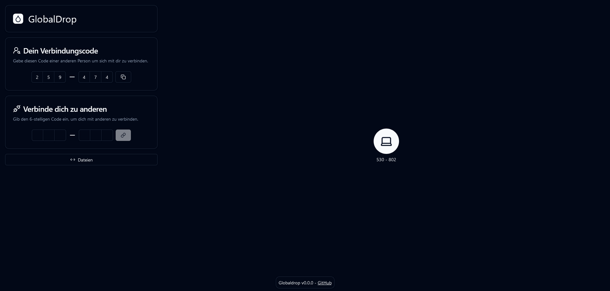
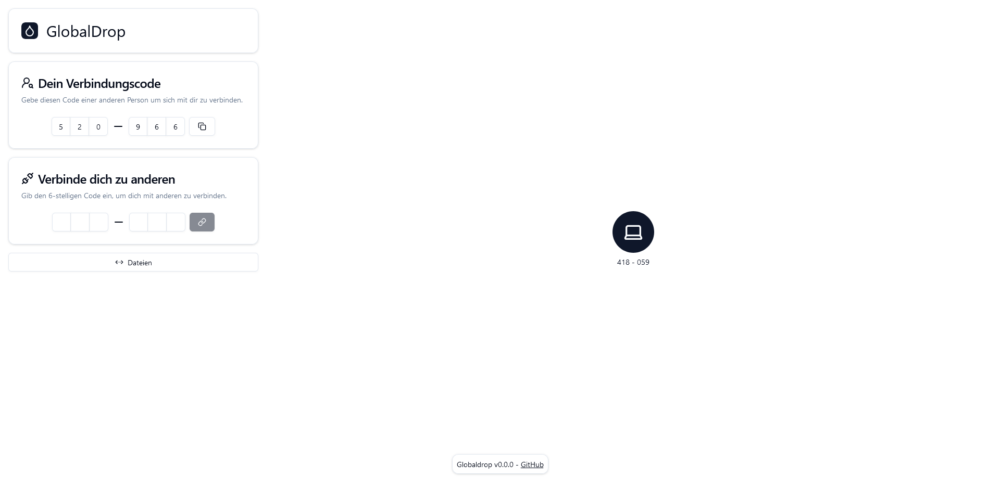
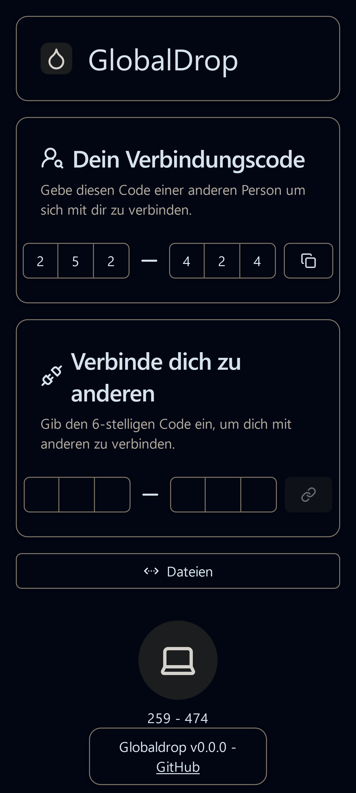
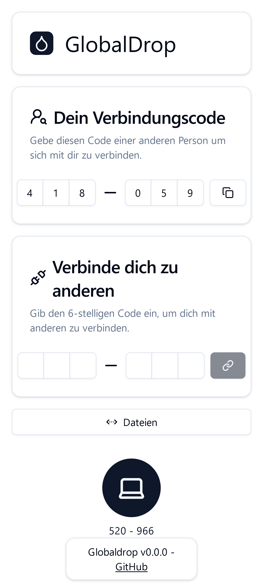

# Globaldrop

[Globaldrop](https://globaldrop.me) is a way to share local files through your browser. The project is inspired by [Snapdrop](https://snapdrop.net) but extends its functionality to enable sharing outside of the local network.

The data exchange is performed via P2P connections, with server communication only used for the initial connection setup.

Devices on the local network are automatically detected. Devices from external networks must be added using the connection code.

This is **my first project using React and Node.js**. So, you've been **warned!** 
This project was created as a learning exercise to explore React and Node.js technologies. The project is currently only available in german language.

Globaldrop was built with the following technologies:
* React / shadcn / tailwindcss
* PeerJS
* Node.js

## Screenshots
<details open>
  <summary>Desktop</summary>

  
  
</details>
<details>
  <summary>Mobile</summary>

  
  
</details>

## Project Structure
The project is divided into a client project and a server project. These are located in the respective `gdclient` and `gdserver` directories.
The client project contains all data for the website, while the server project manages rooms and peer connections.
The server must run behind a reverse proxy. It relies on the X-Forwarded-For header to determine the originating IP address.
Otherwise, it trusts the header without verification.

<details>
  <summary>Example docker-compose.yml</summary>

  This example relies on a already running traefik instance.
  ```yaml
  services:
    client:
      build: ./Globaldrop/gdclient
      restart: "unless-stopped"
      volumes:
        - "/etc/timezone:/etc/timezone:ro"
        - "/etc/localtime:/etc/localtime:ro"
      labels:
        - "traefik.enable=true"
        - "traefik.http.routers.gdclient.rule=Host(`globaldrop.me`)"
        - "traefik.http.services.gdclient.loadbalancer.server.port=80"
      networks:
        - proxy
    server:
      build: ./Globaldrop/gdserver
      restart: "unless-stopped"
      volumes:
        - "/etc/timezone:/etc/timezone:ro"
        - "/etc/localtime:/etc/localtime:ro"
      labels:
        - "traefik.enable=true"
        - "traefik.http.routers.gdserver.rule=Host(`globaldrop.me`) && (PathPrefix(`/room`) || PathPrefix(`/peer`))"
        - "traefik.http.services.gdserver.loadbalancer.server.port=9000"
      networks:
        - proxy
      environment:
        - "PORT=9000"
        - "ROOM_ORIGIN=https://globaldrop.me"
  networks:
    proxy:
      external: true
      name: rproxy
  ```
</details>